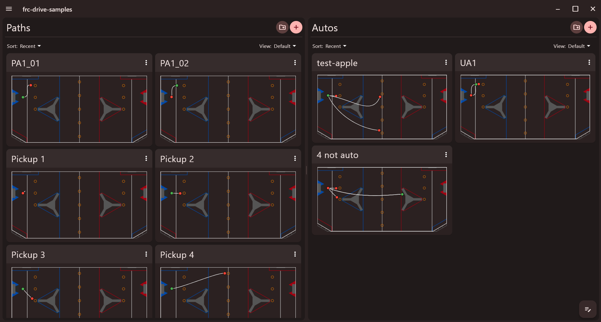
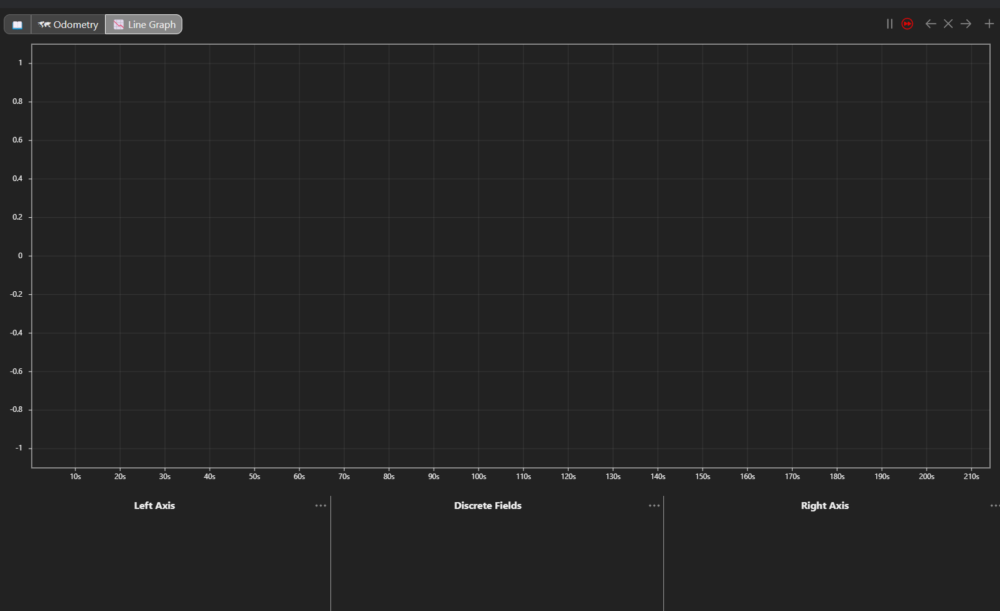
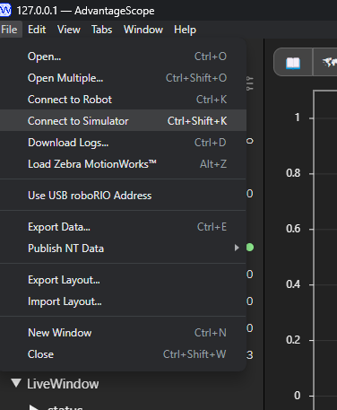
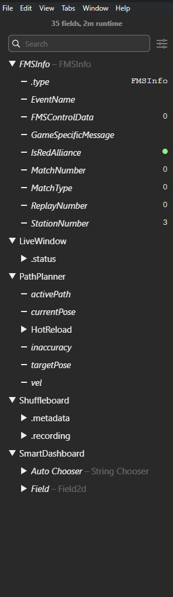
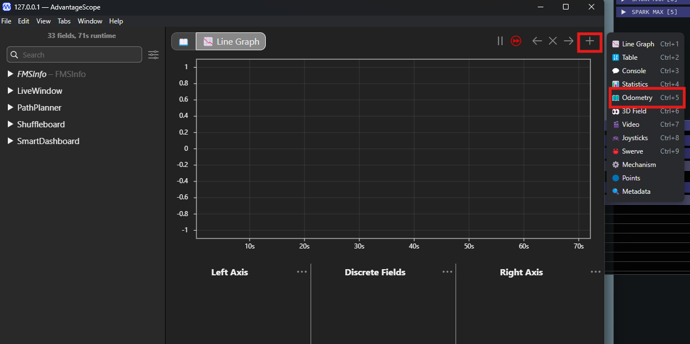
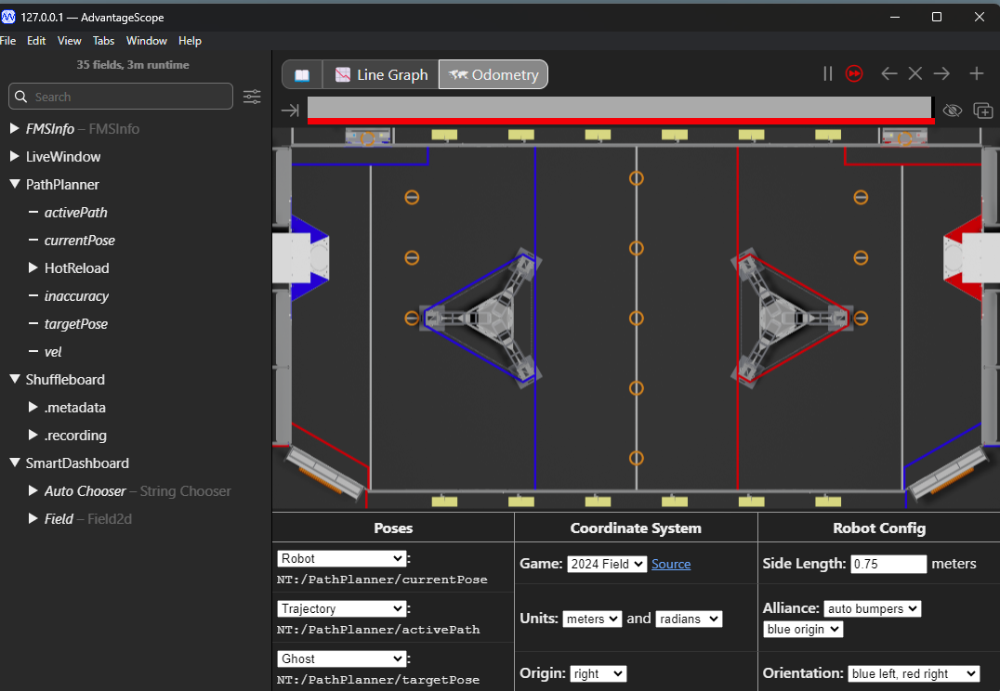
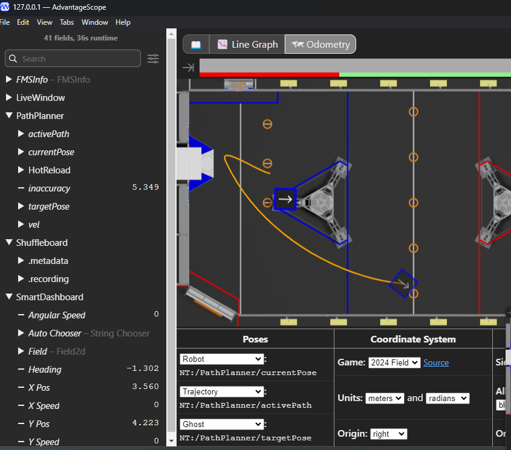

6/27/24 --Completed activity 1. 

## Activity 1: Setup Paths with Pathplanner

### PART A: Setup Apps and Repo
- Clone [this](https://github.com/beranki/frc-drive-samples/tree/training/samples) repository. Make sure that it is replicated in a place that you can easily navigate to. (Why? When we get to setting up Pathplanner, you're going to have to navigate to this with your file explorer. Just a heads up.)
- Inside your WPILib VS Code interface, do the following: 
    - Open WPILib Command Palette (press the little WPILib logo in the top right) → WPILib: Manage Vendor Libraries → Install New Libraries (online) → “https://3015rangerrobotics.github.io/pathplannerlib/PathplannerLib.json”

- Follow [these](https://github.com/mjansen4857/pathplanner/releases) instructions to install the latest version of PathPlanner that complies with your OS.
- When you finish this, open up PathPlanner, and it should prompt you to **Open Robot Project**. 
    - *hint, this is the repo that you just cloned! now is the time to select it with your OS' file explorer.*

- It should then prompt you with a GUI that looks something like this.

    - Yes, it should come with some preloaded paths. In this repository, we have added some paths for you to test with and ensure that things work before you start toying around. :)

- To make sure that you are able to access AdvantageScope and the Sim GUI, open the WPILib command palette and select "WPILib: Simulate Robot Code".
    - At this point, it should return **BUILD SUCCESSFUL** in the console and should then prompt you to select the Sim GUI and(or) the Driver Station. *Just select the Sim GUI for now*. It should look something like this (you might not have the same widget layouts, which is ok.):
    - 
    - You should also make sure that you can access AdvantageScope. You can do this by opening the command tool, and selecting "WPILib: Start Tool". It will then prompt you with a list of options -- select AdvantageScope. When you first open it, it might look something like this:
    - 

## PART B - Connecting to Simulator and Testing Prewritten Paths
- At this point, you have installed PathPlanner and opened the Sim GUI and AdvantageScope. We're now going to use all 3 to simulate some paths and visualize expected vs. actual trajectory. Let's start!
    - This repository contains code to help simulate the trajectory of the robot during autonomous with commands from PathPlanner. We're going to use AdvantageScope to help simulate and visualize the odometry.
- To do this, we're going to need to open AdvantageScope first with the Start Tool option. At first, it's going to tell you it's not connected to anything -- this is expected, as we do not have the simulation running yet. 
    - Then we're going to connect to the Sim GUI. Once we open it, we can now open AdvantageScope, go to File in the top left, and select "Connect to Simulator."
    
    - If you've connected, you'll notice that the side tab is going to populate with Shuffleboard and robot diagnostic data. (data might not be the same, but the idea is it'll show up -- indicating it's connected to the simulator now.)
    
    - That line graph is also going to start moving as it logs real-time data. (PS: It will be empty for now.)
    - If you're wondering what it is connecting to, when you run the Sim GUI, it initiates a NetworkTables client, which AdvantageScope connects to as a "simulator."
- At this point, navigate to AdvantageScope and click on the plus button in the GUI, and select **Odometry**.

- At this point, you should see a empty 2D view of the map, with a table with columns labelled "Poses, Coordinate System, and Robot Config," with data on the left tab of the GUI.
    - Select the PathPlanner tab of the live data tab of the GUI and drag *activePath*, *currentPose*, and *targetPose* into the Poses section. It should look like this:
    

- Now we need to actually run the paths we have, right? To do this, go to your Sim GUI. The things you will need to control here are *The Robot State*, *Auto Chooser*, and *FMS*.
    - These tabs are meant to be filled with data that accurately reflects the path or orientation in which your robot is to run. For the sake of running you through the pipeline of testing Pathplanner w/ AdvantageScope, all 3 "autos" that we have made for you start in the orientation of **Blue 2**. Select that as the Alliance Station in the FMS. Since we're testing the Autonomous section, also select the "Auto" option for match time in the FMS.
    - For the robot state, we keep it at disconnected / disabled when we are configuring FMS info or what auto we want to run (select whichever of the 3 you want to run in the Auto Chooser widget.)
    - When you are ready to run your according auto, switch your robot state from disabled / disconnected to autonomous. It should run accordingly in the AdvantageScope simulation. Try it!
    - 

